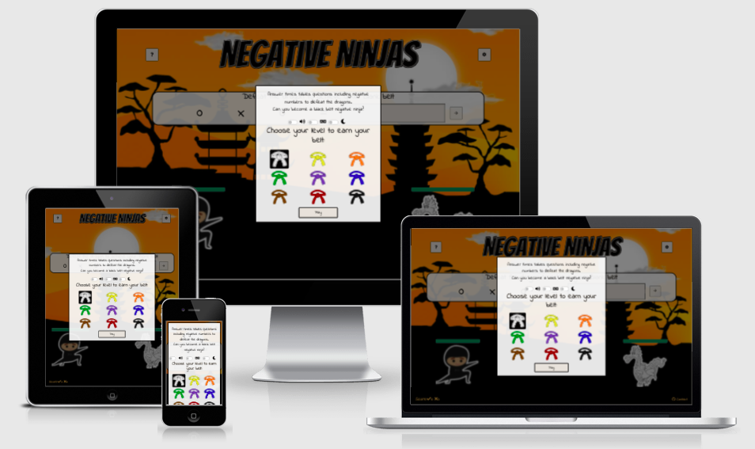
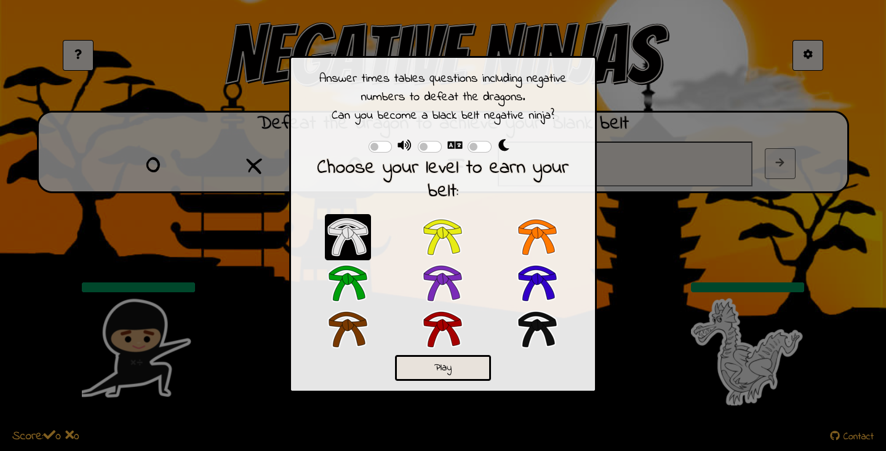
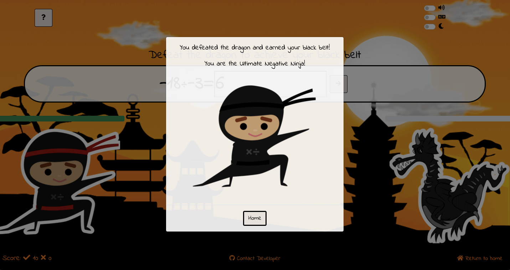

# Negative Ninjas
## Introduction
Negative Ninjas is a web based game built in JavaScript, HTML and CSS. It is a maths based game similar to classic timestables practice but with a focus on multiplication and division with directed numbers. It is targetted towards key stage 3 pupils who would like a fun learning activity. 

[View the live website on GitHub Pages](https://chelsea-designs.github.io/negative-ninjas/)
Please note: To open any links in this document in a new browser tab, please press CTRL + Click.

## Table of Contents
* [User Experience Design (UX)](#UX)
    * [The Strategy Plane](#The-Strategy-Plane)
        * [Site Goals](#Site-Goals)
        * [User Stories](#User-Stories)
    * [The Scope Plane](#The-Scope-Plane)
    * [The Structure Plane](#The-Structure-Plane)
        * [Opportunities](#Opportunities)
    * [The Skeleton Plane](#The-Skeleton-Plane)
        * [Wireframes](#Wireframe-mockups)
    * [The Surface Plane](#The-Surface-Plane)
        * [Design](#Design)
            * [Background Image](#background-image)
            * [Colour Scheme](#Colour-Scheme)
            * [Typography](#Typography)
            * [Characters](#characters)
* [Features](#features)
* [Future Enhancements](#future-enhancements)
* [Testing](#testing)
* [Deployment](#deployment)
* [Credits](#credits)

## UX
### The Strategy Plane
* Negative Ninjas is intended to be a fun game for individual users to play for short periods of time. Looking at other games, small games typically incorporate fun graphical elements that engage the user. The graphical elements and overall design of games immediately provide the user with a visual indicator of what the site is about and set the tone of the interaction.

#### Site Goals
* To provide users with a fun and simple game to play
* To ensure that navigating the site is easy and intuitive, users don't need to work out where to go.
* To provide users with alternative difficulty levels
* To ensure the game is fully accessible on desktop and touch enabled devices
* To ensure the game is fully compliant with keyboard commands and screen readers

### User Stories
* As a user I want a fun and simple game to play
* As a user I want to be able to play a more challenging version of the game
* As a user I want to be able to play an easier and quicker version of the game
* As a user I like to play games late at night and want to be able to control the colours to reduce eye strain
* As a user I want to be able to play the game with my keyboard
* As a user I want to be able to use a screen reader to help me play the game

### The Scope Plane
**Features planned:**
* Responsive Design - The site should function correctly across the range of devices the user could potentially use to access the game on such as Desktop, Laptop, Tablet and Mobiles.
* All navigation elements should be contained within the game screen. No need to search for anything.
* The site should be visually stimulating and clear to the user that it is a game.
* Multiple difficulty levels should be available
* Alternative colour options should be available such as a dark mode
* The site should be fully accessible for keyboard users
* The site should be fully accessible for screen reader users

### The Structure Plane

User Story:
> As a user, I want a fun and simple game to play

Acceptance Criteria:
* It should be clear that it is a game, what it is about and how to play.

Implementation:
* The layout, colour scheme font choice and graphic choices will all convey a sense of fun and make it clear to the user that this is a game site. There will be a help button on the main game page so the user can easily learn how to play and access information about the game.

User Story:
> As a user, I want to be able to play a more challenging version of the game

Acceptance Criteria:
* The user should be able to choose between different difficulty levels. Increasing the challenge if they desire.

Implementation:
* The user will have the ability to change the difficulty level of the game. The levels increase in difficulty including either single or mixed operators and harder multipliers, this will enable the user to make the game easier or more challenging to suit their own preference.

User Story:
> As a user, I want to be able to play a quicker and easier version of the game

Acceptance Criteria:
* The user should be able to choose to play a simplier version of the game.

Implementation:
* The user will have the option to play at the easiest level of the game (white belt).

User Story:
> As a user, I like to play games late at night and want to be able to control the colours to reduce eye strain

Acceptance Criteria:
* The user should be able to change the colours used through out the site to make them darker, therefore reducing eye strain.

Implementation:
* The user will be able to change the colour scheme between a light and dark mode. Dark mode will make the colour palette darker in nature in order to reduce eye strain for the user.

User Story:
> As a user, I want to be able to play the game with a keyboard

Acceptance Criteria:
* It should not be necessary for a user wishing to play with a keyboard to have to use another form of input. All actions within the site and during the game should be able to be accomplished using a keyboard.

Implementation:
* The user will be able to navigate the site using only a keyboard. All elements will be individually selectable through the keyboard and standard keyboard controls.

User Story:
> As a user, I want to be able to use a screen reader to help me play the game

Acceptance Criteria:
* No information about the game should rely on vision to be accessible.

Implementation:
* All none text elements that need to be understood by the user will also include aria-labels to provide the information to screen readers.

#### Opportunities
Arising from user stories
| Opportunities | Importance | Viability / Feasibility
| ------ | :------: | :------: |
| ** Provide a fun game environment ** | 5 | 5 |
| ** Provide fun animations to bring the game to life ** | 5 | 5 |
| ** Provide different difficulty levels ** | 5 | 5 |
| ** Provide ability to change the colour scheme ** | 5 | 5 |
| ** Provide a fully accessible game for keyboard users ** | 5 | 5 |

### The Skeleton Plane
#### Wireframe mockups
I initially utilised Balsamiq to produce low fidelity wireframes of how the game would appear across different devices. Although the game was intended to be contained within one page, wireframes were produced for the different content that would appear on the page. Utilising Balsamiq enabled me to consider multiple layouts for the game elements before settling on the final design.

#### Main Menu

#### Main Game Screen

### The Surface Plane

#### Design

Once happy with the overall structure for the site, and the layout of each section of the content, I produced a full colour mockup within Affinity Photo to test the colour scheme and font selection. The default colour scheme was generated using the Affinity colour selector to pull the colours from the image used as the background. For the dark colour scheme, I followed the recommendations provided by material.io which can be found at [material.io](https://material.io/design/color/dark-theme.html).

##### Background Image

The background image provided the inspiration for the site and the overall theme. I designed it on Affinity Photo.

##### Colour Scheme

To ensure that the colours used for different elements provided the required contrast ratio the colour codes were loaded into a contrast checker available at [Contrast Grid](https://contrast-grid.eightshapes.com/?version=1.1.0&background-colors=&foreground-colors=%23fffff%2C%20White%0D%0A%23E7E2DB%2C%20White%0D%0A%23f8f8f8%2C%20White%0D%0A%23b3b3b3%2C%20%20Light%20Grey%0D%0A%23F8BA50%2C%20%20Light%20Orange%0D%0A%23FB940A%2C%20%20Mid%20Orange%0D%0A%23EA7607%2C%20%20Dark%20Orange%0D%0A%23020101%2C%20Black%0D%0A&es-color-form__tile-size=compact&es-color-form__show-contrast=aaa&es-color-form__show-contrast=aa&es-color-form__show-contrast=aa18&es-color-form__show-contrast=dnp)

Default Colour Scheme

##### Typography

Google fonts was utilised to find a font that would be clean and clear for all users, whilst still conveying an element of youth. I eventually settled on 'Indie Flower' a cursive font which felt appropriate for school children. I decided on 'Bangers' comic book style font to portray a game-type feel.

I also added a thick white border to the Bangers font to add to the game/graphic/comic style.

##### Characters

I drew the ninja image to enforce the ninja/fight theme for the game. I also included the mathematics operators on the ninjas clothing to embrace the numeracy aspect of the game. 

The dragon image was taken from  and then manipulated in Affinity Photo to add belts and recolour. 

I also added a thick white border to the images to add to the game/graphic/comic style and the complement the font styling.

## Features
* Common Features
The site is designed with a central container that the JavaScript inserts the relevant HTML into through toggling. The switches in the top-right corner remain on all screens.

* Main Menu
The main menu is the page of the site that the user is greeted by when they first visit. The design is based on numerous games to provide an instant indication of what the site is about without requiring the user to read too much text. With the levels displayed using simple imagery. This links to the user story 'As a user, I want a fun and simple game to play'. The site visually indicates that it is a game through the use of colour, layout and imagery.

Dark Colour Scheme

* Game Screens
There are two versions of the game and therefore two different game screens, however they follow the same layout and format.
Classic Game

Spock Game

Dark Spock Game Screen

* End Screens
There are three modals available from the main game, one for the next level, one of the replay level and one for the end of game. 

Replay Level

Next Level

Win Modal

## Future Enhancements

* Leaderboard
  * It would be nice to include a leaderboard so that users can compare their score or results with other players, or with themselves over a period of time. This could increase the challenge for users to try and beat other players or their previous scores. The leaderboard would display their speed to achieve black belt.
* Timed Levels
  * The game could be extended through the implementation of timed levels as a way to measure their success in the game and also to add time-pressure to the game could make it more engaging.
* Locked Levels
  * The game could be extended through the implementation of a level structure which would require the player to work their way through the levels to reach the final belt rather than choosing their entry-level.
* Multiplayer
  * Network play mode. It would be nice to include an online multiplayer option to the game to enable users to play the game against another person rather than the dragon.

## Testing

### Testing Strategy

I took a two stage approach to testing the site. The first stage was continuous testing as the site was being developed. This was especially important to do during development of the JavaScript logic to ensure that the different functions and variables contained or returned the correct data type or values. During the styling of the site I would check the visual appearence within a live server window to preview the changes before they were committed.

For the second stage of testing, I utilised a more formal structured approach and created a test schedule for the site and each logical cycle. I then proceeded to run through the tests individually making a note of any errors or changes to the designed behaviour. Any errors were corrected and then the tests repeated.

A full detailed breakdown of the testing proceedures and methodology can be found in the testing.md file [here](TESTING.md)

The full testing excel file can be accessed [here](/assets/documents/testing-schedule.xlsx). A Pdf version of the completed file can be accessed [here](/assets/documents/ufoduel-site-testing-report.pdf).

#### Testing Overview
Testing was divided into different sections to ensure everything was tested individually with test cases developed for each area.

#### Validator Testing
* HTML
  * No errors were returned when passing through the official W3C Validator. [View Report](https://validator.w3.org/nu/?doc=https%3A%2F%2Fmattbcoding.github.io%2Fufoduel%2F)

* CSS
  * No errors were returned when passing through the official W3C CSS Validation Service - Jigsaw. [View Report](https://jigsaw.w3.org/css-validator/validator?uri=https%3A%2F%2Fmattbcoding.github.io%2Fufoduel%2F&profile=css3svg&usermedium=all&warning=1&vextwarning=&lang=en)

* JavaScript
  * No errors were returned when passing through the validator service at JSHint.com. 

* WAVE Web Accessibility
  * Three errors were returned in the WAVE web accessibility report which are detailed in the TESTING.md file along with the resolution. [View Report](https://wave.webaim.org/report#/mattbcoding.github.io/ufoduel/)

* Lighthouse 
  * The lighthouse report gave an almost perfect score of 99, 100, 100, 100. 

#### Notable Bugs
No bugs of note were discovered during the development or testing of the site. However frustration with the different requirements from different browsers was experienced. Multiple small visual errors were encountered during testing across different devices, browsers or browser versions which needed additional CSS style rules to overcome. For example, the submit button was not horizontally centered on the input but this was fixed with display flex. 

## Deployment

### GitHub Pages

The project was deployed to GitHub Pages using the following steps...

1. Log in to GitHub and locate the [GitHub Repository](https://github.com/)
2. At the top of the Repository (not top of page), locate the "Settings" Button on the menu.
3. Scroll down the Settings page until you locate the "Pages" Section.
4. Under "Source", click the dropdown called "None" and select "Main".
5. The page will automatically refresh.
6. At the top of the 'Pages' section, look to locate the now published site [link](https://chelsea-designs.github.io/negative-ninjas/).

### Forking the GitHub Repository

By forking the GitHub Repository we make a copy of the original repository on our GitHub account to view and/or make changes without affecting the original repository by using the following steps...

1. Log in to GitHub and locate the [GitHub Repository](https://chelsea-designs.github.io/negative-ninjas/)
2. At the top of the Repository (not top of page) just above the "Settings" Button on the menu, locate the "Fork" Button.
3. You should now have a copy of the original repository in your GitHub account.

### Making a Local Clone

1. Log in to GitHub and locate the [GitHub Repository](https://chelsea-designs.github.io/negative-ninjas/)
2. Next to the green Gitpod button, to the left, locate the "Code" button and click.
3. To clone the repository using HTTPS, under "Clone with HTTPS", copy the link.
4. Open Git Bash
5. Change the current working directory to the location where you want the cloned directory to be made.
6. Type `git clone`, and then paste the URL you copied in Step 3.
7. Press Enter. Your local clone will be created.

## Credits

### Code

-   [Bootstrap5](https://getbootstrap.com/docs/5.1/getting-started/introduction/): Bootstrap Library used throughout the project mainly to make site responsive using the Bootstrap Grid System. Also, code was used from the Bootstrap Components Library for dropdown menu, buttons and accordions etc.
-   [Academind](https://academind.com/tutorials/adding-dark-mode): Dark mode.
-   [W3Schools](https://www.w3schools.com/howto/howto_css_switch.asp): How to create the custom toggle switches used in the settings modal were developed from a tutorial.

### Content

-   All content was written by myself.

### Media

-   Images displaying website design across devices generated by [AmIResponsive](http://ami.responsivedesign.is/)

-   Images of ninjas and background created by myself.

-   Dragon, ninja star and fireball copyright-free images from .

### Acknowledgements

-   My mentor for helpful feedback.

-   Tutor support at Code Institute for their support.

-   My peers for their support through Stack.